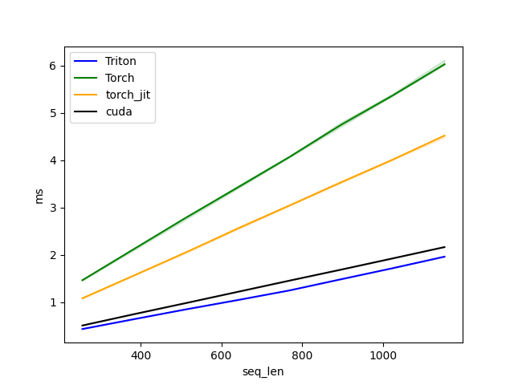
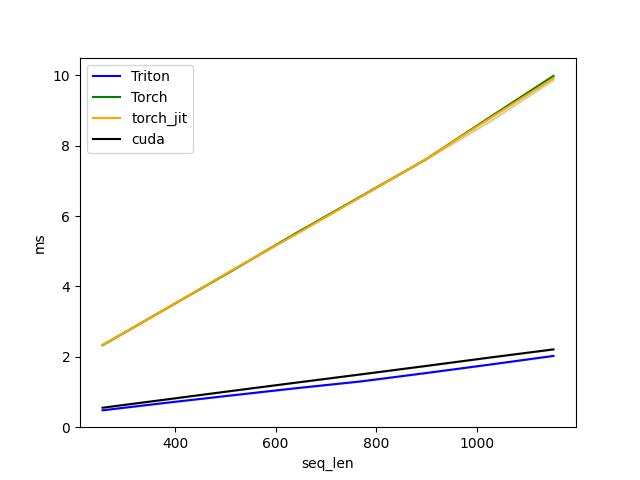

# Compiler_Study

# RoPE
## Analysis
Goals : RoPE의 performance의 bottleneck이 Memory read/write 인지 operation 인지 파악
방법론 : 기존 benchmark tool 사용
  - torch.utils.bottleneck
  - torch profiler
  - 위의 두가지 방법을 사용해봤으나, 경험이 부족해 원래 목적대로 활용하기엔 힘들었음. (aten::copy가 dominant)
  - 수식 자체가 복잡하지 않기 때문에 연산 관련한 병렬화는 기존 라이브러리도 잘 했을 거라 보고, memory access 횟수를 줄여보기로 함.
## Forward
### 수식 분석
  - Function의 input t의 d 방향이 2번씩 (cos와 곱해질 때, sin과 곱해질 때) 쓰임.
  - m * theta 를 의미하는 freqs는 b, h 방향으로 공유됨.
### 최적화
  - seq, batch, head 방향으로 연산을 최적화하고, d 방향으로 input data를 한번씩만 읽게끔하기 위해 d방향의 앞쪽 절반, 뒤쪽 절반에 대해 함꼐 구함.
## Backward
### 수식 분석
  - Let g = RoPE(t, freqs)
  - dL/dt = dg/dt * dL/dg, dL/dg : input of the backward path (dy)
  - g[0,0,0,0] = t[0,0,0,0] * cos(freqs[0,0,0,0]) - t[0,0,0,d/2] * sin(freqs[0,0,0,0])
  - g[0,0,0,d/2] = t[0,0,0,d/2] * cos(freqs[0,0,0,d/2]) + t[0,0,0,0] * sin(freqs[0,0,0,d/2])
  - dg/dt[0,0,0,0] = dy[0,0,0,0] * (cos(freqs[0,0,0,0])) + dy[0,0,0,d/2] * sin(freqs[0,0,0,d/2])
  - dg/dt[0,0,0,d/2] = - dy[0,0,0,0] * sin(freqs[0,0,0,0]) + dy[0,0,0,d/2] * cos(freqs[0,0,0,d/2])
### 최적화
  - Forward와 동일하게 d 방향으로 input data를 한번씩만 읽게끔함. Forward와 수식만 다름.
  - freqs의 d가 input의 d보다 작은 경우 남는 영역은 forward와 마찬가지로 dy 값 복사 (dg/dt = 1)
## Results
### Forward

### Backward

## Setting Env
- NGC 위에서 test를 진행했습니다.
- NGC 위에서 conda 를 사용했을 때 benchmark에서 에러가 발생해 부득이하게 docker command를 올립니다.
```
git clone https://github.com/hannnnnnnnnnnnn/Compiler_Study.git

sudo docker run --gpus all --ipc=host --ulimit memlock=-1 --ulimit stack=67108864 -v <cur_path>/Compiler_Study:/workspace/Compiler_Study --rm -it nvcr.io/nvidia/pytorch:23.10-py3

# inside NGC
pip install git+https://github.com/NVIDIA/TransformerEngine.git@stable
pip install triton --upgrade

```
## Test
- 가능한 function input argument에 대해 torch.testing.assert_close 로 체크.
- 빠른 test를 위해 freqs를 논문과 달리 torch.randn으로 생성
- forward, backward 각 12600 case
```
git clone https://github.com/hannnnnnnnnnnnn/Compiler_Study.git

cd Compiler_Study/RoPE

pytest
```
## Run benchmark
- torch, torch jit(custom), triton, fused by cuda 에 대해 다양한 sequence length의 forward, backward compute time 측정
- d, h, b 는 각각 512, 10, 16 임의의 숫자로 고정 후 측정. (다른 조합도 해봤지만 크게 양상이 바뀌진 않음)
```
git clone https://github.com/hannnnnnnnnnnnn/Compiler_Study.git

cd Compiler_Study/RoPE

python bench_RoPE.py
```


